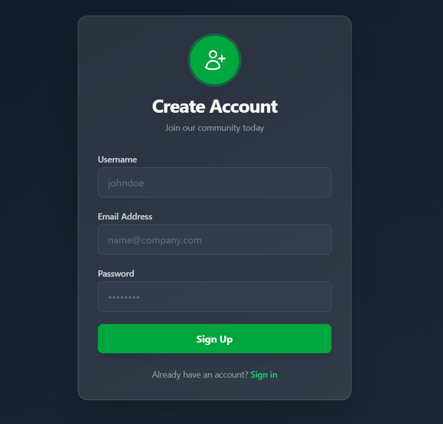
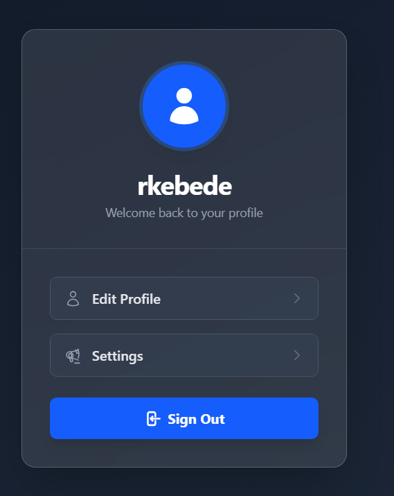

# Full-Stack Authentication & Dashboard App

A robust MERN stack application featuring secure user authentication, a RESTful API, and a modern, premium UI dashboard designed with Tailwind CSS.

##  Features

### Backend (Node.js & Express)
*   **RESTful API**: Clean and structured API endpoints.
*   **MongoDB Integration**: Data persistence using Mongoose.
*   **Authentication**: Secure user registration and login using **JWT (JSON Web Tokens)**.
*   **Security**: Password hashing with **bcryptjs** and vigilant input validation.
*   **CORS**: Configured for flexible frontend integration.

### Frontend (React & Vite)
*   **Modern UI**: Built with **React 19** and **Vite** for blazing fast performance.
*   **Premium Design**: Features a **Glassmorphism** aesthetic with vibrant animated gradients using **Tailwind CSS**.
*   **Responsive**: Fully responsive dashboard layout (Mobile & Desktop).
*   **State Management**: Context API for global authentication state.
*   **Protected Routes**: Secure client-side routing to prevent unauthorized access.

##  Tech Stack

*   **MongoDB**: NoSQL Database
*   **Express.js**: Backend Framework
*   **React**: Frontend Library
*   **Node.js**: Runtime Environment
*   **Tailwind CSS**: Utility-first CSS framework (v4)

##  Getting Started

### Prerequisites
*   Node.js installed
*   MongoDB URI

### Installation

1.  **Clone the repository**
    ```bash
    git clone https://github.com/Redeatke/Restful-back-end-API.git
    ```

2.  **Backend Setup**
    ```bash
    cd backend
    npm install
    # Create a .env file with PORT and MONGO_URI
    npm start
    ```

3.  **Frontend Setup**
    ```bash
    cd frontend
    npm install
    npm run dev
    ```

##  Screenshots



